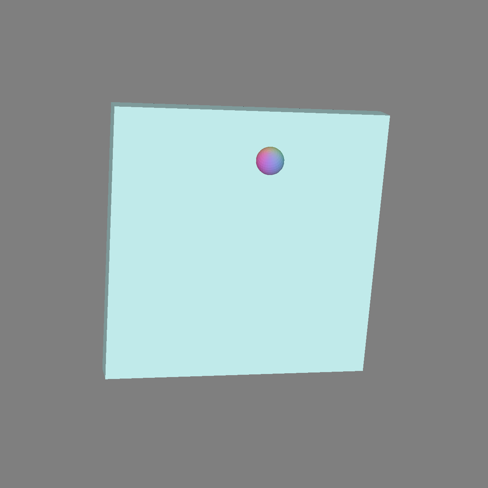

# (TODO: your game's title)

Author: Pengtao

Design: Balance the ball on the board. There is randomly generated wind and corresponding chiming.

Screen Shot:

How To Play:

Arrows keys to control the rotation of the board. R to restart. W to turn on/off wind.
The pan, pitch and volume of the chime corresponds to the x direction, y direction, and strength of the wind, respectively.

Sources: https://freesound.org/people/mandymatz/sounds/424033/

This game was built with [NEST](NEST.md).

